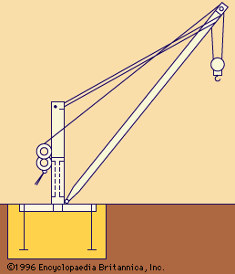

# Nonlinear flexible dynamics examples

## Loader  
This model represents a simplified front end of a front loader and contains the following parts:
* Loader Front Frame
* Lifting Arm
* Bucket
* ...

The cylinders are represented with axial springs dampers, while the joints are represented by revolute joints.

### case 1: Simple lift
The model is activated with a time dependent function for the spring elongation.

The model is loaded by increasing the mass in the bucket.

### Case 2: Improved cylinder models
Beam elements are used to model the cylinders, improving the mass distribution and the stiffness of the cylinders.

### Case 3: Improved load model, using mass elements

### Case 4: Improved cylinder control, using PID controller

## Jib crane

