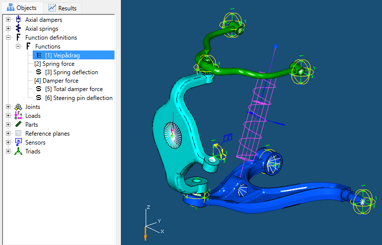
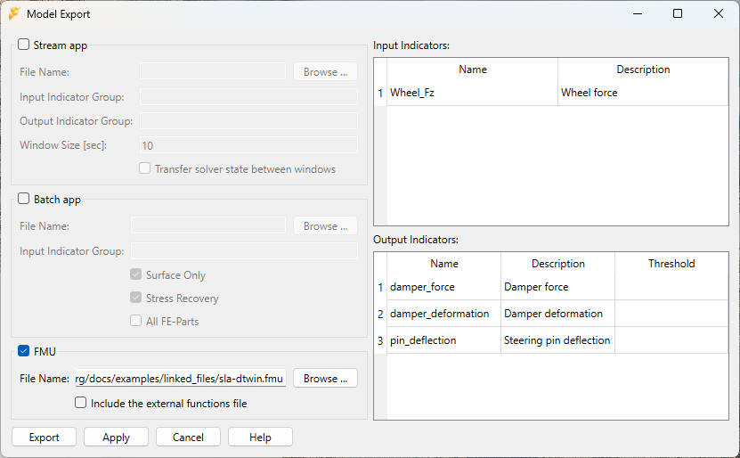
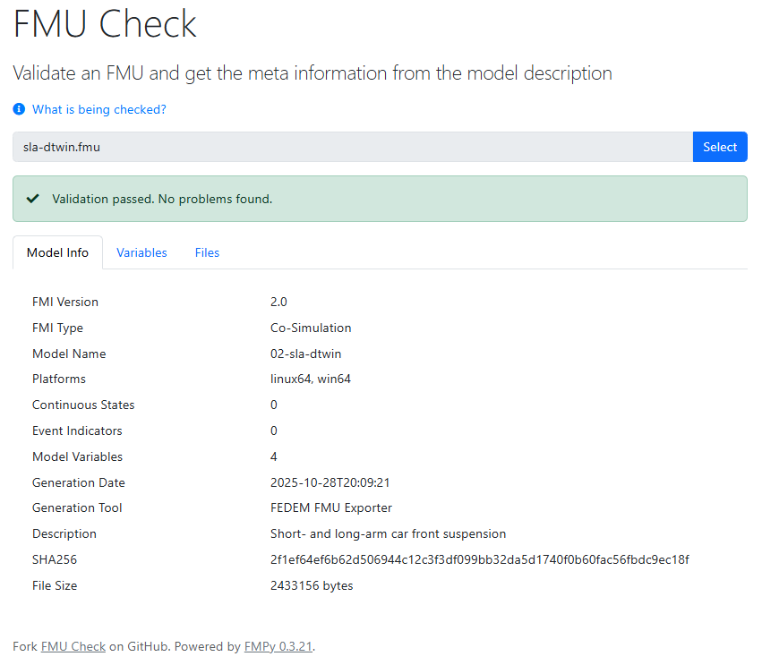
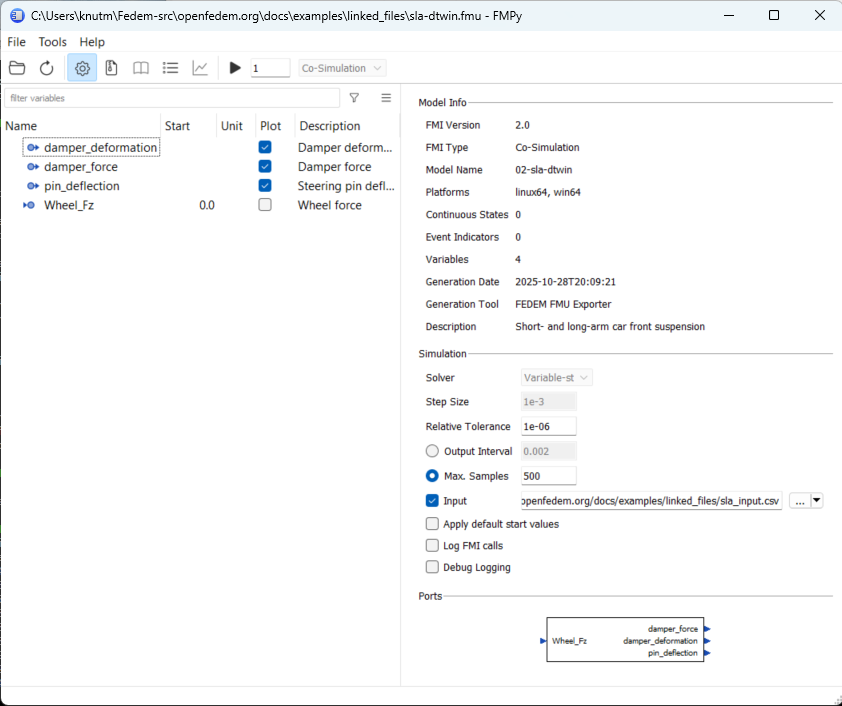
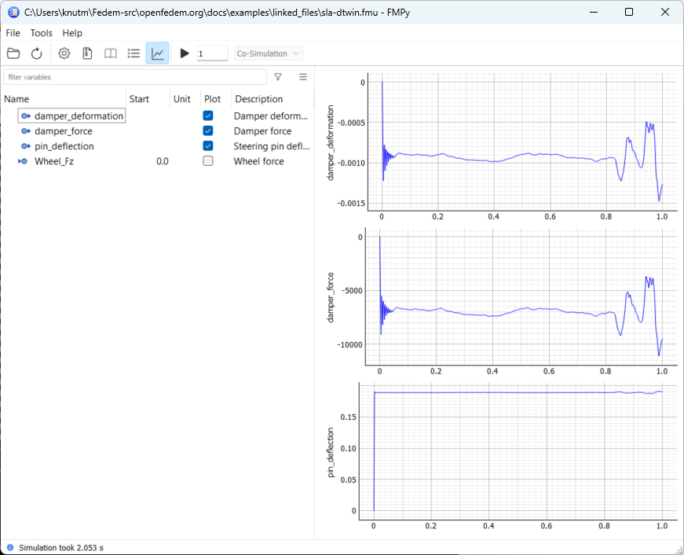

# Digital Twins models

The concept of Digital Twins of a physical asset can be modelled in FEDEM
where loads and/or actuators get their input from external sources, such as
sensors on the real asset, and produce real-time simulated response data.
The model can then be wrapped in a FMU (Functional Mockup Unit) based on the
[FMI-standard](https://fmi-standard.org) for use in a co-simulation environment.

To demonstrate how this can be done, we consider a simple car front suspension
model consisting of three FE parts:

* Lower control arm
* Upper control arm
* Knuckle

The three FE parts are connected using Ball joint objects,
while an Axial Spring and a Damper are used to represent the physical damper.



## Digital twin input

A vertical external force is applied in the wheel hub Triad in the model.
The force magnitude is defined using an External function object in FEDEM
(indicated by the "**E**" icon in the Objects tree in the image above).
As opposed to all the other Function types which can use various response
quantities (including the time itself) as function argument, External functions
are typically assigned their value by the calling process managing the time step
loop of the numerical simulation.

## Digital twin output

In this model we want to monitor the force and deflection in the damper,
in addition to the vertical deflection of the steering pin Triad.
Since the damper is composed of two structural elements between the end triads,
we define a *Math expression* Function object summing the Force of the Axial
spring and the Axial damper. This function is then marked as Output sensor
(the "**S**" icon in the Objects three). In addition, two other Function
objects are defined simply as 1-to-1 functions, where the respective response
quantities (the damper deformation and the Z-position of the pin Triad)
are defined as arguments. These three functions will then serve as virtual
sensors that can be evaluated by the calling process during the time step loop.

## Creating the digital twin using fedempy

Here is a low-code python script creating the car suspension model shown above.
The FE models used are found [here](linked_files/sla_FEparts.zip).

[Download...](linked_files/sla_modeling.py)

```python
from os import mkdir, path
from pathlib import Path

from fedempy.modeler import FedemModeler
from fedempy.enums import FmDof, FmDofStat, FmType, FmVar

# Global constants
RELATIVE_PATH = '02-car-front-suspension/'
MODEL_FILE    = '02-sla-dtwin.fmm'
PARTS_PATH    = 'parts/'

# Prepare run directory (=RELATIVE_PATH)
model_file = Path(RELATIVE_PATH) / MODEL_FILE
if not path.isdir(model_file.parent):
    mkdir(model_file.parent)

# Create a new FEDEM model
my_model = FedemModeler(str(model_file), True,
                        name="Short- and long-arm car front suspension")

# Load the FE parts
lca     = my_model.make_fe_part(PARTS_PATH + 'lca.nas')
knuckle = my_model.make_fe_part(PARTS_PATH + 'knuckle.nas')
uca     = my_model.make_fe_part(PARTS_PATH + 'uca.nas')

# Lower control arm joints to ground
j1 = my_model.make_joint('Fix 1', FmType.BALL_JOINT,
                         my_model.make_triad('lca fixed', node=11911, on_part=lca))
j2 = my_model.make_joint('Fix 2', FmType.BALL_JOINT,
                         my_model.make_triad('lca fixed', node=11912, on_part=lca))

# Knuckle to lower control arm joint
j3 = my_model.make_joint('Lower Ball', FmType.BALL_JOINT,
                         my_model.make_triad('knuckle lower', node=3, on_part=knuckle),
                         my_model.make_triad('lca tip',   node=11910, on_part=lca))

# Upper control arm to knuckle joint
j4 = my_model.make_joint('Upper Ball', FmType.BALL_JOINT,
                         my_model.make_triad('uca tip',    node=2160, on_part=uca),
                         my_model.make_triad('knuckle upper', node=4, on_part=knuckle))

# Upper control arm joints to ground
j5 = my_model.make_joint('Fix 3', FmType.BALL_JOINT,
                         my_model.make_triad('uca fixed',  node=2159, on_part=uca))
j6 = my_model.make_joint('Fix 4', FmType.BALL_JOINT,
                         my_model.make_triad('uca fixed',  node=2158, on_part=uca))

# Steering pin triad
t0 = my_model.make_triad('Steering pin', node=2, on_part=knuckle)
my_model.edit_triad(t0, constraints={'Tx' : FmDofStat.FIXED})

# Spring/Damper triads
t1 = my_model.make_triad('Damper connection', node=11909, on_part=lca)
t2 = my_model.make_triad('Ground', pos=(0.0, 0.0, 0.3),
                         on_part=my_model.fm_get_refplane())

# Spring/Damper
s1 = my_model.make_spring('Spring', (t1, t2), init_Stiff_Coeff=7.5e6)
d1 = my_model.make_damper('Damper', (t1, t2), init_Damp_Coeff=3.0e3)

# Wheel hub triad with external vertical force
t3 = my_model.make_triad('Wheel hub', node=1, on_part=knuckle)
my_model.edit_triad(t3, load={'Tz' : my_model.make_function('Wheel force', tag='Wheel_Fz')})

# Ouput sensors
my_model.make_sensor('Damper force', (s1, d1), FmVar.FORCE, tag='damper_force')
my_model.make_sensor('Damper deformation', s1, FmVar.DEFLECTION, tag='damper_deformation')
my_model.make_sensor('Steering pin deflection', t0, FmVar.POS, FmDof.TZ, tag='pin_deflection')

my_model.fm_solver_setup(t_inc=0.005, t_end=2.5, t_quasi=-1.0)
my_model.fm_solver_tol(1.0e-6,1.0e-6,1.0e-6)
my_model.close(True, True)
```

## Exporting a FMU from FEDEM

Before the model can be exported, the FE models need to be reduced into
superelements since the FMU will only conduct the dynamics simulation
of the mechanism model. This can be done with `fedempy` using:

    $ python -m fedempy.fmm_solver -f 02-sla-dtwin.fmm --reduce-only

Alternatively, you can open the generated model in the FEDEM GUI and perform the
model reduction there.

To export the FMU, open the model in the GUI (and perform the model reduction,
if not already done so), and open the Model Export dialog box shown below.
You find this in the *File* menu (*File --> Export --> Export Digital Twin...*).



This dialog box shows three alternative ways of exporting the model,
but only the **FMU** option is relevant here. So enable that toggle.
Then use the **Browse...** button to selected the name for the fmu-file.
In the right side of the dialog, you find a list of the input- and output
indicators in the model, corresponding to the external functions
and output sensors defined in the modelling script.
Notice in particular the *Name* column. The strings here will be
used to identify the input and outputs in the exported FMU.
They are defined using the *tag* keyword in the modelling script

Press the **Export** button to generate the FMU, and then exit the FEDEM GUI.

## Testing the FMU

To verify that the created FMU works, you can use a tool such as
[FMPy](https://github.com/CATIA-Systems/FMPy) which also has a GUI from where
you can controll the simulation. It is also convenient to make a python script
to run it from console or to integrate with a larger simulation environment.

First, you can use the web-based static checker
[FMU Check](https://fmu-check.herokuapp.com/) to validate the FMU before doing
any simulation attempt. For the FMU of this example
(named [sla-dtwin.fmu](linked_files/sla-dtwin.fmu)), it will produce the following:



If you have installed the FMPy module, you may also use its CLI to check it.
From a console window, run the command `$ fmpy info sla-dtwin.fmu`:

    $ fmpy info sla-dtwin.fmu

    Model Info

      FMI Version        2.0
      FMI Type           Co-Simulation
      Model Name         02-sla-dtwin
      Description        Short- and long-arm car front suspension
      Platforms          linux64, win64
      Continuous States  0
      Event Indicators   0
      Variables          4
      Generation Tool    FEDEM FMU Exporter
      Generation Date    2025-10-28T20:09:21


    Variables (input, output)

      Name               Causality              Start Value  Unit     Description
      Wheel_Fz           input                          0.0           Wheel force
      damper_force       output                                       Damper force
      damper_deformation output                                       Damper deformation
      pin_deflection     output                                       Steering pin deflection

With this looking good, the next step is to try to run the FMU.
Since it has one input variable, a file containing some time history of
this quantity is needed. For this test, please use the file
[sla_input.csv](linked_files/sla_input.csv). The first line of the input file
needs to contain the name(s) of the input variable(s) as column headers.
Otherwise it will fail, even if only one input variable is present.

*Note:* A FEDEM FMU only contains the simulation data model in addition to
the FMU configuration files, but not the FEDEM solver itself. The FMU assumes
that a working FEDEM installation exist on the host running it, and the solver
is accessed via an environment variable:

    FEDEM_SOLVER = full path to fedem_solver_core.dll or libfedem_solver_core.so

This environment variable needs to be defined in the shell running the FMU.
You can fetch the necessary binaries from the
[fedem-solvers](https://github.com/openfedem/fedem-solvers/releases)
repository on github. You may also use the solvers embedded with the
full FEDEM GUI installation.

Using the FMPy GUI (`$ python -m fmpy.gui`), select the *sla-dtwin.fmu* file
exported from the FEDEM FMU exporter, and then select *sla_input.csv* as the
input file:



Then run the simulation to produce the results:



Below we present a simple python driver, which will run though the simulation
as it is set up in the model in the same way as the FMPy GUI above will do.
The script takes the input for each time step from a specified input file,
and prints the output sensor values to the console.
Use this as a template for more advanced co-simulation tasks with FEDEM FMUs.

[Download...](linked_files/run_fedem_fmu.py)

```python
from fmpy import fmi2, read_model_description, extract
from pandas import read_csv
from sys import argv


def run(fmu_file, input_file=None, instance_name="my instance"):
    """
    Runs the specified FMU
    """
    # Read the model description
    print("Reading model description from", fmu_file)
    model = read_model_description(fmu_file)

    # Extract the FMU itself
    print("Extracting", fmu_file, "...")
    unzipdir = extract(fmu_file)

    # Setup the FMU
    print("Setup the FMU", model.coSimulation.modelIdentifier)
    fmu = fmi2.FMU2Slave(guid=model.guid, unzipDirectory=unzipdir,
                         modelIdentifier=model.coSimulation.modelIdentifier,
                         instanceName=instance_name)
    fmu.instantiate()
    fmu.enterInitializationMode()
    fmu.exitInitializationMode()

    # Get some size parameters from the FMU
    num_params = fmu.getInteger([1, 2])
    num_inputs = num_params[0] # Number of input sensors
    num_output = num_params[1] # Number of output sensors

    # Read the input values into a Dataframe
    if input_file is None:
        inputs = None
    elif num_inputs > 0:
        inputs = read_csv(input_file, sep="\t")

    # List of external function indices
    inpIdx = range(num_inputs)
    # List of output sensor indices
    outIdx = range(num_inputs,num_inputs+num_output)

    # Time loop, this will run through the FEDEM simulation
    # using the time domain setup of the model file used to export the FMU.
    # The two parameters to the doStep() call are dummies (time and step size).
    # They are not used in the FMU so the values are arbitrary (2*0.0 is fine).
    step = 0
    while not fmu.getBooleanStatus(fmi2.fmi2Terminated):
        if inputs is not None:  # Set external function values for next step
            # First column of inputs is not used, assuming it contains the time
            fmu.setReal([*inpIdx], inputs.iloc[step].tolist()[1:])

        fmu.doStep(0.0, 0.0)  # Advance the simulation on step

        step += 1
        time = fmu.getRealStatus(fmi2.fmi2LastSuccessfulTime)
        output = fmu.getReal([*outIdx])
        print(f"Here are the outputs at step={step} time={time}:", output)

    # Finished, close down
    fmu.terminate()
    fmu.freeInstance()


if __name__ == "__main__":
    if len(argv) > 3:
        run(argv[1], argv[2], argv[3])
    elif len(argv) > 2:
        run(argv[1], argv[2])
    elif len(argv) > 1:
        run(argv[1])
    else:
        print(f"Usage: {argv[0]} <fmu-file> [<input-file>] [<instance name>]")
```
