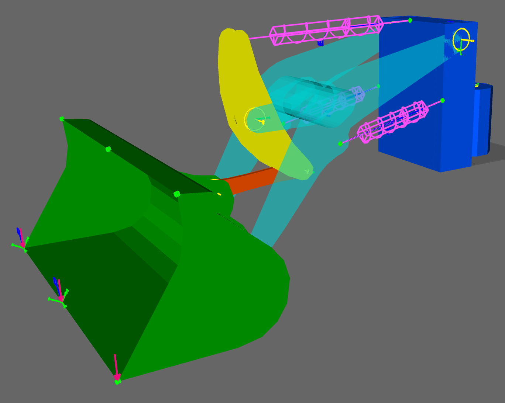

# The Loader

This example consists of a simplified model of a tractor front-end loader.
The model consists of the following five FE Parts which can be downloaded
[here](linked_files/loader_FEparts.zip).

* Loader Front Frame
* Lifting Arm
* Bucket
* Bell crank
* Bucket link

The hydraulic cylinders are represented by Axial Springs
while the joints are represented by Revolute joint objects.



## Basic lifting operation

The model is activated with a time-dependent function for the spring elongation.

The model is loaded by increasing the mass in the bucket.

<!--
## Improved cylinder models
Beam elements are used to model the cylinders, improving the mass distribution and the stiffness of the cylinders.

## Case 3: Improved load model, using mass elements
## Case 4: Improved cylinder control, using PID controller
-->

## Model and solver control using the Python API

To create and solve this model, the following items needs to be
imported from the [fedempy](../python_api.md) module.

```python
from fedempy.fmm_solver import FmmSolver
from fedempy.modeler import FedemModeler
from fedempy.enums import FmDof, FmDofStat, FmLoadType, FmType, FmVar
```

## Low-code modelling and solving

Here is a complete python script that creates and runs the Loader model.
Make sure to unzip the file with the [FE models](linked_files/loader_FEparts.zip)
before running the script.

[Download...](linked_files/loader_modeling_and_solving.py)

```python
from os import mkdir, path
from pathlib import Path

from fedempy.fmm_solver import FmmSolver
from fedempy.modeler import FedemModeler
from fedempy.enums import FmDofStat, FmLoadType, FmType

# Global constants
RELATIVE_PATH = '00-loader-base_case/'
MODEL_FILE    = '00-loader-base_case.fmm'
PARTS_PATH    = 'parts/'

# Prepare run directory (=RELATIVE_PATH)
model_file = Path(RELATIVE_PATH) / MODEL_FILE
if not path.isdir(model_file.parent):
    mkdir(model_file.parent)

# Create a new FEDEM model
my_model = FedemModeler(str(model_file), force_new=True)

# Load the FE parts
p1 = my_model.make_fe_part(PARTS_PATH + 'Front.flm')
p2 = my_model.make_fe_part(PARTS_PATH + 'Boom.flm')
p3 = my_model.make_fe_part(PARTS_PATH + 'Bucket.flm')
p4 = my_model.make_fe_part(PARTS_PATH + 'BellCrank.flm')
p5 = my_model.make_fe_part(PARTS_PATH + 'BucketLink.flm')

# Edit some part properties
my_model.edit_part([p1, p2, p3, p4, p5], alpha2=0.00286, component_modes=0, consistent_mass=True)
my_model.edit_part(p2, Tx=0.01080263, Tz=-0.77487206)
my_model.edit_part(p3, Tx=-0.64636636, Tz=-2.0328088, Ry=-30, Rz=-180)
my_model.edit_part(p4, Tx=-3.2499752, Ty=-2.8376081, Tz=0.04694241, Ry=21.814096)
my_model.edit_part(p5, Tx=-2.041544, Ty=-0.92750001, Tz=0.12191465, Ry=-4.9156169)

# Create revolute joints coupling the FE parts together and to ground
joints = []
joints.append(my_model.make_joint('Rev1', FmType.REVOLUTE_JOINT, 8))
joints.append(my_model.make_joint('Rev2', FmType.REVOLUTE_JOINT, 11))
joints.append(my_model.make_joint('Rev3', FmType.REVOLUTE_JOINT, 19, 7))
joints.append(my_model.make_joint('Rev4', FmType.REVOLUTE_JOINT, 24, 6))
joints.append(my_model.make_joint('Rev5', FmType.REVOLUTE_JOINT, 38, 22))
joints.append(my_model.make_joint('Rev6', FmType.REVOLUTE_JOINT, 33, 17))
joints.append(my_model.make_joint('Rev7', FmType.REVOLUTE_JOINT, 49, 21))
joints.append(my_model.make_joint('Rev8', FmType.REVOLUTE_JOINT, 48, 20))
joints.append(my_model.make_joint('Rev9', FmType.REVOLUTE_JOINT, 56, 47))
joints.append(my_model.make_joint('Rv10', FmType.REVOLUTE_JOINT, 55, 35))

my_model.edit_joint(joints[2], Ry=90, Rz=-90)
[my_model.edit_joint(id, Rx=90) for id in joints[3:]]

# Create functions
f1 = my_model.make_function('Lift Cylinders',
     frequency=0.625, amplitude=0.15, delay=0.25, mean_value=0.15, end=0.8)

f2 = my_model.make_function('Boom Cylinder',
     slope=-0.5, start_ramp=0.5, end_ramp=1.2)

f3 = my_model.make_function('Rotation Front',
     frequency=0.5, amplitude=0.262, delay=0.25, mean_value=0.262, end=1.0)

f4 = my_model.make_function('Bucket Load',
     slope=50000, start_ramp=0.7, end_ramp=1.2)

my_model.edit_joint(joints[0], constraints={'Rz' : FmDofStat.SPRING},
     spring={'Rz' : 1.0e9}, length={'Rz' : f3})

cyl = my_model.make_spring('Lift cylinder', [(9, 23), (10, 18)],
      init_Stiff_Coeff=1.0e9, length=f1)

cyl.append(my_model.make_spring('Boom cylinder', (5, 50),
      init_Stiff_Coeff=1.0e9, length=f2))

my_model.make_load('Load', FmLoadType.FORCE, 39, (0, 0, -1), fn=f4)

my_model.fm_solver_setup(t_inc=0.01, t_end=1.6)
my_model.close(True, True)

# Solver setup and execution
my_solver = FmmSolver()
my_solver.solve_all(str(model_file), True, True)
```

## No-code modeling

It is also possible to create the FEDEM model without writing python code.
Instead, the model is described using YAML-syntax.

To create this model, execute the command:

    $ python -m fedempy.yaml_parser -f loader_model.yaml

[Download...](linked_files/loader_model.yaml)

```yaml
target_file: 02-loader-y100.fmm
file_exists: OVERWRITE!

fe_parts:
  p1: [parts/Front.ftl]
  p2: [parts/Boom.ftl]
  p3: [parts/Bucket.ftl]
  p4: [parts/BellCrank.ftl]
  p5: [parts/BucketLink.ftl]

triads_from_fe_parts:
  Front_fix_bottom:                [Front bottom bearing housing to ground,  p1, node,  441]
  front_fix_top:                   [Front top bearing housing to ground,     p1, node,  211]
  front_right_housing:             [Front right bearing housing,             p1, node,   38]
  front_left_housing:              [Front left bearing housing,              p1, node,   58]
  front_top_cylinder_attachment:   [Front top cylinder attachment point,     p1, node,   18]
  front_right_cylinder_attachment: [Front right cylinder attachment point,   p1, node,  222]
  front_left_cylinder_attachment:  [Front left cylinder attachment point,    p1, node,  235]

  boom_rear_right_houding:         [Boom right rear bearing housing,         p2, node, 1038]
  boom_rear_left_housing:          [Boom left rear bearing housing,          p2, node,  178]
  boom_front_right_housing:        [Boom right front bearing housing,        p2, node,  715]
  boom_front_left_housing:         [Boom left front bearing housing,         p2, node,    5]
  boom_right_bellcrank_housing:    [Boom right bearing housing to BellCrank, p2, node,  545]
  boom_left_bellcrank_housing:     [Boom left bearing housing to BellCrank,  p2, node,  424]
  boom_right_cylinder_attachment:  [Boom right cylinder attachment point,    p2, node,  829]
  boom_left_cylinder_attachment:   [Boom left cylinder attachment point,     p2, node,  119]

  bucket_right_housing:            [Bucket right housing,                    p3, node,  509]
  bucket_mid_housing:              [Bucket midt housing,                     p3, node,  451]
  bucket_left_housing:             [Bucket left housing,                     p3, node,  284]

  bellcrank_top_housing:           [BellCrank top housing,                   p4, node,  420]
  bellcrank_bottom_housing:        [BellCrank bottom housing,                p4, node,   14]
  bellcrank_right_housing:         [BellCrank right housing,                 p4, node,  276]
  bellcrank_left_housing:          [BellCrank left housing,                  p4, node,  244]

  bucketlink_rear_houding:         [BucketLink rear housing,                 p5, node,  575]
  bucketlink_front_housing:        [BucketLink front housing,                p5, node,  174]

edit_fe_parts:
  p1: &link_property
    alpha2: 0.00286
    component_modes: 0
    consistent_mass: True
  p2:
    <<: *link_property
    Tx:  0.01080263
    Tz: -0.77487206
  p3:
    <<: *link_property
    Tx:   -0.64636636
    Tz:   -2.0328088
    Ry:  -30
    Rz: -180
  p4:
    <<: *link_property
    Tx: -3.2499752
    Ty: -2.8376081
    Tz:  0.04694241
    Ry: 21.814096
  p5:
    <<: *link_property
    Tx: -2.041544
    Ty: -0.92750001
    Tz:  0.12191465
    Ry: -4.9156169

joints:
  j01: [Front bottom to ground,  BALL_JOINT, Front_fix_bottom]
  j02: [Front top to ground,     BALL_JOINT, front_fix_top]

  j03: [Front to boom right,     BALL_JOINT, front_right_housing,          boom_rear_right_houding]
  j04: [Front to boom left,      BALL_JOINT, front_left_housing,           boom_rear_left_housing]

  j05: [Boom to bucket right,    BALL_JOINT, boom_front_right_housing,     bucket_right_housing]
  j06: [Boom to bucket left,     BALL_JOINT, boom_front_left_housing,      bucket_left_housing]

  j07: [Bucket link rear,        BALL_JOINT, bucketlink_rear_houding,      bellcrank_bottom_housing]
  j08: [Bucket link front,       BALL_JOINT, bucketlink_front_housing,     bucket_mid_housing]

  j09: [Boom to bellCrank right, BALL_JOINT, boom_right_bellcrank_housing, bellcrank_right_housing]
  j10: [Boom to BellCrank left,  BALL_JOINT, boom_left_bellcrank_housing,  bellcrank_left_housing]

hydraulic_cylinders:  # User-defined function
  Top_cylinder:   [Top cylinder,   front_top_cylinder_attachment,
    bellcrank_top_housing, 0.15, 0.12, 0.05, 0.7, 0.7, 1.0e+4]

  Right_cylinder: [Right cylinder, front_right_cylinder_attachment,
    boom_right_cylinder_attachment, 0.15, 0.12, 0.05, 0.7, 0.7, 1.0e+6]

  Left_cylinder:  [Left cylinder,  front_left_cylinder_attachment,
    boom_left_cylinder_attachment, 0.15, 0.12, 0.05, 0.7, 0.7, 1.0e+6]

fedem_objects:
  p10:
    kind: PART
    ORIGINAL_FE_FILE: parts/Front.ftl

    COORDINATE_SYSTEM:
      - [1.0, 0.0, 0.0, 1.0]
      - [0.0, 1.0, 0.0, 1.0]
      - [0.0, 0.0, 1.0, 1.0]

    DESCR: Front no. 2 | tagging_2

```
