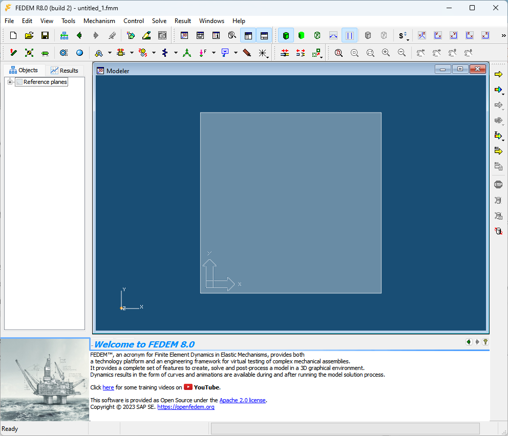

# How to get started with FEDEM

The easiest way to get started with FEDEM is to download and install
the latest built release, and run some of the example models provided.

## Installation

Currently, binaries are provided for Windows (64-bit) only.
To install the latest release, proceed as follows:

* Go to the [Releases](https://github.com/SAP/fedem-gui/releases) page
  on the [fedem-gui](https://github.com/SAP/fedem-gui) repository on github.
* Download the most recent zip-file `FedemInstaller-*.zip`
* Unzip this file at arbitrary location on your PC.
* Execute the `INSTALL.bat` file as administrator.
  This will (by default) install the software in the folder "C:\Program Files\FEDEM"
  on your PC, set the file association for FEDEM model files to the GUI executable
  (`Fedem.exe`), and optionally create short-cuts to the executable on the user's Desktop
  and in the Windows Start menu.
* Unless you already have Microsoft Visual Studio installed (2015 or later),
  you also need to download and install some C++ runtime libraries from
  [Microsoft](https://learn.microsoft.com/en-us/cpp/windows/latest-supported-vc-redist?view=msvc-170)
  before you can run the installed FEDEM GUI or solvers on Windows.
  That is, download the file [vc_redist.x64.exe](https://aka.ms/vs/17/release/vc_redist.x64.exe)
  and execute it as administrator.

## First Run

{: align="right" style="height:40px;width:40px"}
To start FEDEM with an empty model, either double-click the FEDEM icon on the Desktop,
or select in from the Windows Start menu. The welcome screen of the FEDEM GUI
should then (after a few seconds) appear, like this:

The FEDEM main windows consists of the following items:

* At the very top there is a line of standard Menus (_File_, _Edit_, etc).
* Next there are two lines (the tool bars) containing somw buttons used to
  initiate commands also found in the Menus.
* One of the tool bars (for executing the solvers) are placed vertically to the right.
* In the left part of the window is the _Model Manager panel_, containing
  the _Objects_ and _Results_ tabs, which allow you to create, manage, and delete
  the objects in your model, and to define Animations and Graphs for your results.
* The largest part of the main window is occupied by the Workspace area,
  containing the _Modeler_, _Control Editor_ and _Graph_ views for constructing
  and viewing models and results. Initially (like in the image above),
  it only displays the Reference plane.
* The lower left part of the main window contains the _ID and Topology panel_
  which lists objects related to the selected item.
* The area below the Workspace area is the _Property Editor panel_,
  which allows you to view and edit the properties of individual objects in the model.
* At the very bottom of the main window, the _Status bar_ is located,
  which provides information of the status, progress information
  and whether a solver process is running.

Refer to the [Users Guide](fedem_docs/FedemUsersGuide.pdf) for further details on the FEDEM GUI.

If you already have a FEDEM model file, the easiest way to open it is to just double-click the file in the Windows file browser.

## Basic Solver Configuration

Setting up for the first simulation.
