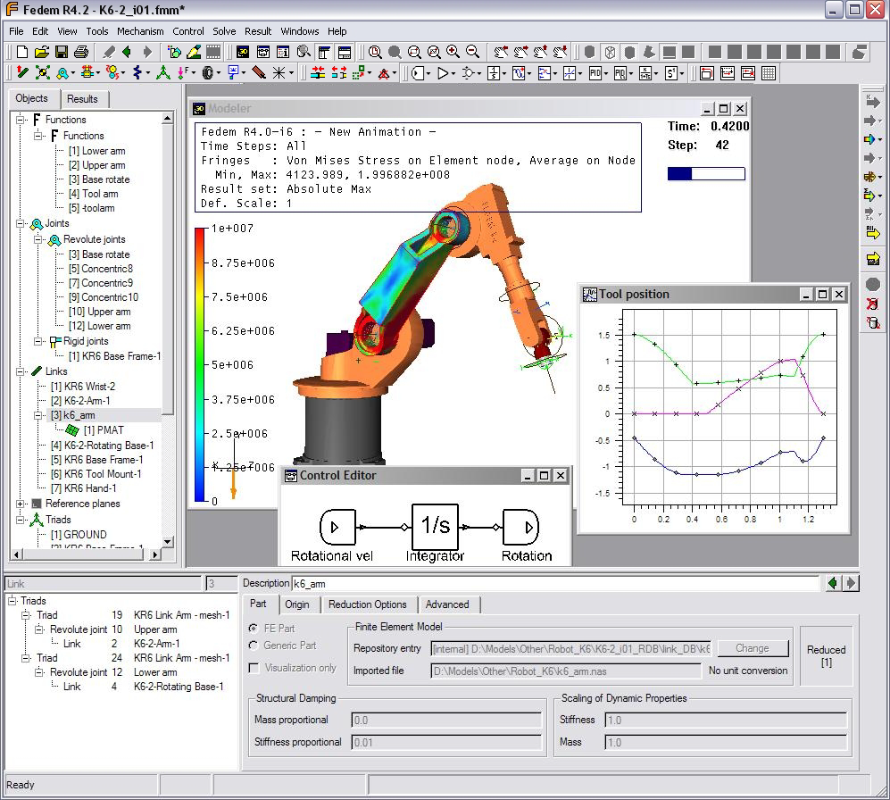

# About the software

Fedem, an acronym for **F**inite **E**lement **D**ynamics in **E**lastic **M**echanisms,
provides both a technology platform and an engineering framework for virtual testing of complex mechanical assemblies.
It provides a complete set of features to create, solve and post-process a model in a 3D graphical environment. 
Dynamics results in the form of curves and animations are available during and after model solution.
Combined with the fast and numerically stable Fedem solvers, the user interface facilitates an engineering process
with shortened turnaround times and quick access to simulation results for a clearer understanding of the physical
behavior of the model. Fedem also provides intuitive and high-performing post-processing capabilities, including 
full stress analysis, eigenmode solutions, strain gage solutions and fatigue analysis for selected time steps.

<!
## Core Features
 
Highlight unique aspects like real-time simulation, advanced material modeling, etc.

## Target Audience 
Engineers, researchers, and students in structural dynamics and civil engineering.
>

