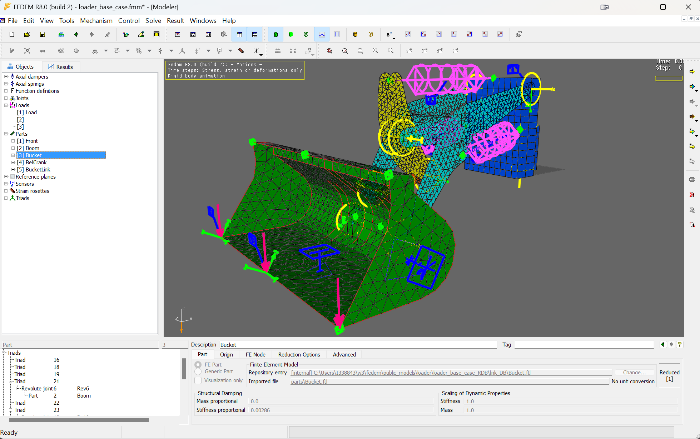

# Welcome to FEDEM

## About the software

FEDEM, an acronym for **F**inite **E**lement **D**ynamics in **E**lastic **M**echanisms,
provides both a technology platform and an engineering framework for virtual testing of complex mechanical assemblies.
It provides a complete set of features to create, solve and post-process a model in a 3D graphical environment.
Dynamics results in the form of curves and animations are available during and after model solution.
Combined with the fast and numerically stable FEDEM solvers, the user interface facilitates an engineering process
with shortened turnaround times and quick access to simulation results for a clearer understanding of the physical
behavior of the model. FEDEM also provides intuitive and high-performing post-processing capabilities, including
full stress analysis, eigenmode solutions, strain gage solutions and fatigue analysis for selected time steps.

## Core features

The core features of the FEDEM software, as outlined in the user guide and related documentation, include:

1. **Modeling and Simulation**: FEDEM allows users to create complex models using its graphical user interface (GUI). These models can include various mechanical components and systems, enabling detailed simulation of dynamic behavior.

2. **Multibody Dynamics**: The software specializes in active nonlinear multibody dynamics[^1], allowing for the analysis of systems composed of interconnected rigid and flexible bodies. This is particularly useful for studying the motion and forces within mechanical systems.

3. **Finite Element Analysis (FEA)**: FEDEM integrates FEA capabilities to analyze the structural integrity of components under various load conditions. This feature is essential for stress and deformation analysis.

4. **Integrated Solvers**: FEDEM includes solvers for both dynamic and static analysis, providing comprehensive tools for engineers to evaluate the performance of their models under different scenarios.

5. **User Interface and Visualization**: The software features an intuitive user interface that simplifies the modeling process. It also offers robust visualization tools to help users interpret simulation results effectively.

6. **Customization and Scripting**: Advanced users can extend the functionality of FEDEM through scripting and customization, enabling automation of repetitive tasks and integration with other software tools.

7. **Application in Various Industries**: FEDEM is used across multiple industries, including aerospace, automotive, and energy, for tasks such as designing mechanical systems, evaluating structural components, and optimizing product performance.

8. **Marine features**: Regular and irregular waves (JONSWAP), current, vessel RAOs[^2], sea environment with marine growth. Import of standard marine components, such as mooring lines, beam strings, space frames (Jackets).

9. **Slender soil piles**: Soil pile interaction represented by P-Z, P-Y and T-Z curves emulating degradation of soil stiffness.

10. **Windpower features**: Modeling and simulation of wind turbines with aerodynamic forces.
This feature was enabled by an earlier version of [AeroDyn](https://www.nrel.gov/wind/nwtc/aerodyn.html) by NREL, which is integrated with the FEDEM dynamics solver.
AeroDyn uses the BEM (Blade Element Momentum) theory, which combines blade element theory and momentum theory to calculate the aerodynamic forces on each section of the wind turbine blade.
The functionality is based on AeroDyn version 13 and has not been updated to support the newer versions 14 and 15.
AeroDyn 13 is not included with the FEDEM open source project. However, if you have interest in this capability,
please reach out to us with an email to the [developers](mailto:developers@openfedem.org).

## History

The theory behind the FEDEM solvers was originally developed by the late
Professor Ole Ivar Sivertsen, during the late 1970s and through the 1980s.
His work initiated new Ph.D. studies and international R&D projects
that contributed to the development of the first FEDEM software product.

On the basis of Professor Sivertsen's work, a company was established in 1992
by SINTEF, Northern Europe's largest R&D institute based in Trondheim, Norway.
Computer speed reached levels that would allow the theories to produce results,
and visualization technology made it possible to create a user interface.
During this period the FEDEM software was strictly an inhouse code at SINTEF.

In 1995 the company Fedem AS, which later became Fedem Technology AS,
continued the development of the user interface and made it possible to offer
FEDEM as a commercial product in 1998.

The FEDEM software was continuously developed as a product by Fedem Technology AS
during the 2000s and 2010s while it was also used as an internal tool in
various consultancy projects, until the company was acquired by SAP SE in 2016.
Since then, the FEDEM solvers have been provided as components in the
EPD Connected Products by SAP, until the sunsetting of the Connected Products
in 2023. It was then decided to release FEDEM under an open source license
on GitHub, as a service to the existing user community.

## Licensing

The software is licenced under the [Apache 2.0](https://opensource.org/license/apache-2-0/) license.
For detailed information, visit the [FEDEM GUI](https://github.com/openfedem/fedem-gui/blob/main/LICENSE)
or [FEDEM Solvers](https://github.com/openfedem/fedem-solvers/blob/main/LICENSE) license descriptions.

## Footnotes

[^1]: Active nonlinear multibody dynamics refers to the simulation of systems composed of interconnected flexible bodies where both the geometry and the forces involved can change in a nonlinear manner over time. This involves complex interactions and deformations, requiring sophisticated numerical methods to accurately model the behavior of the system under various conditions. The term "active" indicates the presence of a control system that dynamically influences the behavior and responses of the system, enhancing its ability to adapt to varying conditions and inputs.

[^2]: RAO is a frequency-domain representation that quantifies how much a vessel will respond to a given wave frequency. It is expressed as a ratio of the vessel's motion amplitude in Surge, Sway, Heave, Roll, Pitch, Yaw to the wave amplitude for each frequency component.
