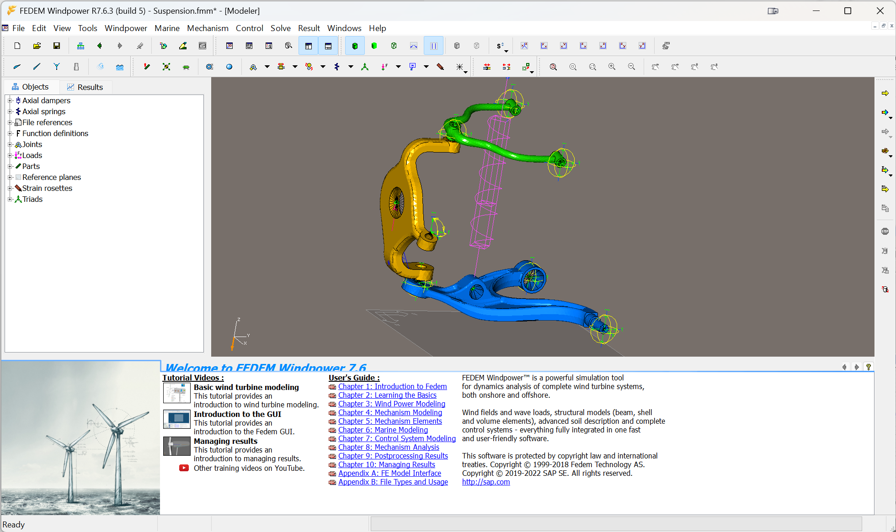

# Tutorials

## SLA Suspension

Tutorial and model download:

* [sla_suspension-tutorial.pdf](linked_files/sla_suspension-tutorial.pdf)
* [sla_suspension-model.zip](linked_files/sla_suspension-model.zip)

<!--
## Scissor lift

Tutorial and model download:

* [scissor_lift-tutorial.pdf](linked_files%2Fscissor_lift-tutorial.pdf)
* [scissor_lift-model.zip](linked_files%2Fscissor_lift-model.zip)

## Welding grip

Tutorial and model download:

* [welding_grip-tutorial.pdf](linked_files%2Fwelding_grip-tutorial.pdf)
* [welding_grip-model.zip](linked_files%2Fwelding_grip-model.zip)

## Universal Joint

Tutorial and model download:

* [universal_joint-tutorial.pdf](linked_files%2Funiversal_joint-tutorial.pdf)
* [universal_joint-model.zip](linked_files%2Funiversal_joint-model.zip)

## Spring-supported cantilever

Tutorial and model download:

* [spring_supported_cantilever-tutorial.pdf](linked_files%2Fspring_supported_cantilever-tutorial.pdf)
* [spring_supported_cantilever-model.zip](linked_files%2Fspring_supported_cantilever-model.zip)

## Buoyant cylinder

Tutorial and model download:

* [buoyant_cylinder-tutorial.pdf](linked_files%2Fbuoyant_cylinder-tutorial.pdf)
* [buoyant_cylinder-model.zip](linked_files%2Fbuoyant_cylinder-model.zip)
-->

